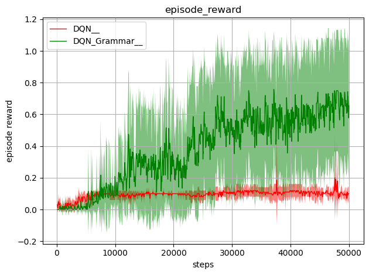
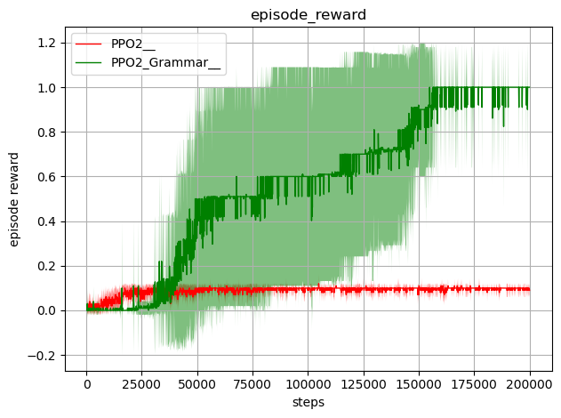
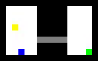
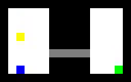

# RL Grammar Constrained
In this repository we suggest an implementation for agents who use Context Free Grammar rules in their learning process.
We use the stable baselines implementations of DQN and PPO2 agents with the following small change:

*The agent cannot choose actions that will violate grammar rules.*

This approach can be used in order to give the agent prior knowledge of temporal structures that solves the environment he is trying to learn.


# Files in the repository
1. stable_baselines_master - Cloned version of Stable-Baselines with changes to DQN and PPO2 algorithms
2. cyk_prefix_parser - Implementations of cyk algorithm, cyk algorithm with prefix check variation, CFG to CNF converter (see README file in folder for the original sources and more details)
3. gym_random_rooms - Environment based on OpanAI Gym API (see README file in folder for more details).
4. action_filters.py - Example filters of actions to be used as part of our algorithm (AllPassFilter, GrammarFilter)
5. merge_runs.py - Plotting mean and std of several runs from tensorboard logs (after interpolation)
6. main.py - Example main program to run
7. grammar.txt, grammar_cnf.txt - Grammar example file and the result of cfg2cnf from it.

# Requirements
1. Tensorflow versions from 1.8.0 to 1.14.0
2. Python3 (>=3.5)

# Example
1. Create the grammar file according to rules defined on cyk_prefix_parser folder - grammar.txt
	this file will be used to define the patterns agent *must* follow

2. Install stable_baselines_master folder:
```
pip install -e stable_baselines_master
```

3. Run the following main code:
```
import os
import matplotlib.pyplot as plt
import gym
from stable_baselines import PPO2, DQN
from action_filters import AllPassFilter, GrammarFilter


if __name__ == '__main__':
    time_steps = 200000
    env = gym.make(env_id)

    log_dir = "./log/"
    log_name = "env_id_GrammarHistory30_PPO2"
    env.reset()

    model = PPO2('CnnPolicy', env, tensorboard_log=log_dir, filter=GrammarFilter(history_size=30, negate_grammar=False, grammar_file="grammar.txt"))
    # model = PPO2('CnnPolicy', env, tensorboard_log=log_dir, ent_coef=0.05, filter=AllPassFilter())
    model.learn(total_timesteps=time_steps, tb_log_name=log_name)
    env.close()
```
4. Merge multiple results of different runs with the same log_name:
```
python merge_runs.py log res
```
5. res.png is the average plot of each run type.

# Hyper-parameters
1. the original stable baselines DQN or PPO2 hyper-parameters.
2. history_size - The horizon of actions history that the grammar is checked against. History buffer is emptied whenever the episode ends or its size surpasses history_size. 
3. negate_grammar - If False the grammar defines what pattern the agent should do, if True the grammar defines what the agent shouldn't do.
4. grammar_on_exploration (for DQN only) - if True the grammar rules will apply to exploration actions as well. 

# Results
These are the results of PPO2 and DQN algorithms on the Random Rooms environment:
DQN            |  PPO2
:-------------------------:|:-------------------------:
  |  

With both algorithms we can see a significant improvement in performance when grammar constraints are used.

Grammar PPO2 and regular PPO2 after training 1900 episodes respectively:

 
