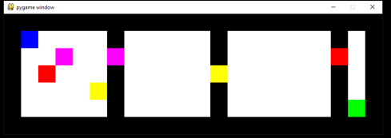
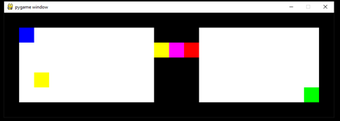

# Installing:
cd to folder gym-random_rooms and run:

pip3 install -e .

# How to use:
```
import gym_random_rooms
env = gym.make('random_rooms-v0', ...)
```

# About the Environment:

## The agent's goal:
1. pick a key or several keys
2. open doors
3. reach a goal cell (set in a fixed place at the bottom right cell of the board)
In each episode intial state is changed 


## The parameters of the environment:
1. cols – number of Cols in board
2. rows – number of Rows in board
3. doors_num – number of doors in environment
4. upsample – increasing size of observation (each cell is represented by (upsample X upsample) block) 
5. max_steps – max steps until reset
6. n_inner_resets – how many resets until change locations of keys and doors
7. inner_counter_in_state – will add channel of inner_counter_till_locations_change/n_inner_resets
8. same_places – if False it will change locations every episode. If True remain same all run (unless n_inner_resets will pass)
9. bundle_doors – if True all doors together right after each other in order (and one channel), otherwise channel per door in different locations.
10. master_key – if True 1 key for all doors, otherwise different key for each door
11. key_reward – will give additional reward (for each pick)
12. door_reward – will give additional reward (for opening all doors)


## Reward:
We assume: keys*key_reward + door_reward < 1

Max reward = 1 (for reaching goal cell)

## Action Space:
0 – null

1 – up

2 – down

3 – left

4 – right

5 – pick

6, 7, 8, ... – toggle doors

## channels of the observation (each represented by numpy array in size of board):
1. state
2. goal
3. walls map
4. one for each key
5. if bundle_doors: one channel for all doors, else: one for each door
6. optional counter)

# Examples:
## Random Doors, No master key

## Bundle Doors, With master key

